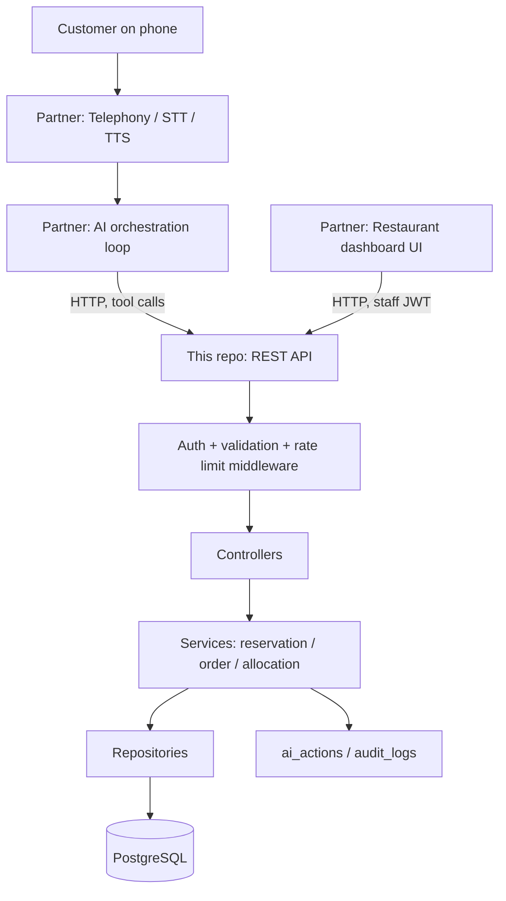

# Architecture

## Stack

- Node.js + Express, plain JavaScript (no TypeScript — keeps the hackathon build simple and the
  codebase approachable for a student reading every line).
- PostgreSQL, accessed through `pg` (node-postgres) with **parameterized queries only**. No ORM.
  See `DECISIONS.md` for why.
- `node-pg-migrate` for versioned SQL migrations.
- `zod` for request validation schemas.
- `jsonwebtoken` + `bcrypt` for restaurant staff authentication (the dashboard/admin surface).
- `pino` for structured JSON logging.
- `express-rate-limit` for rate limiting.
- `jest` + `supertest` for tests, run against a real disposable Postgres database.

## Layering

```
Routes
  ↓
Controllers        (parse req, call validator, call service, shape response)
  ↓
Validators (zod)    (reject malformed input before anything else runs)
  ↓
Services            (business logic: table allocation, pricing, scoring rules, state transitions)
  ↓
Repositories        (the only code that touches `pg` directly; every query is parameterized)
  ↓
PostgreSQL
```

A controller never queries the database directly, and a service never writes raw SQL — both route
through the layer below. This is what keeps the SQL-injection and mass-assignment guarantees true
by construction rather than by review discipline.

## Component diagram



The AI orchestrator and the restaurant dashboard are both just HTTP clients of the same REST API —
neither gets a special internal code path. This is also what proves the AI isn't decorative: the
dashboard and the AI hit the same reservation/order engine, so the AI genuinely has to go through
real authorization and business logic to get anything done.

## AI tool call flow (one tool invocation)

```
AI decides to call check_table_availability(restaurantId, date, time, partySize)
  → POST /api/v1/ai/tools/check-table-availability   (Authorization: session-scoped AI token)
  → middleware: rate limit, validate body against zod schema, resolve restaurant from the
    authenticated session (never trust the restaurantId field blindly — see DATABASE.md tenant note)
  → controller calls reservationService.checkAvailability(...)
  → service queries tables + overlapping reservations via repository
  → service returns { available, options: [...] } or { available: false, alternatives: [...] }
  → controller logs the call to ai_actions (sanitized input/output, duration, status)
  → structured JSON result returned to the AI orchestrator
  → AI relays "we don't have 7, but 7:30 works" to the customer in natural language
```

The AI never sees a raw database row, a price it didn't request, or another restaurant's data —
tool responses are shaped explicitly per tool, documented in `AI_TOOLS.md`.

## Multi-tenant security boundary

Every restaurant-owned table carries `restaurant_id`. The *authenticated actor* determines which
restaurant(s) it may act on:

- Staff/admin JWT → `restaurant_users` row(s) for that `user_id` determine allowed restaurant IDs.
- AI/voice session → the `conversation_sessions.restaurant_id` set when the session was created
  (tied to the phone number the restaurant's line was dialed on — the orchestrator doesn't get to
  pick a different restaurant mid-call).

A client-supplied `restaurantId` in a request body is **never** trusted as the authorization
source — it's cross-checked against the resolved restaurant and rejected (403) on mismatch. See
`SECURITY.md`.

## Conversation/session state

`conversation_sessions.state` (jsonb) holds the structured slot-filling state described in
`AGENT_FLOW.md` (intent, date, time, partySize, customerName, reservationId, ...). The backend
treats this as an opaque, validated-on-write JSON blob it merges on `PATCH`, not something it
interprets — the orchestrator owns the meaning of the fields, the backend just persists them
reliably between turns (important since a telephony webhook handler is typically stateless per
request).
